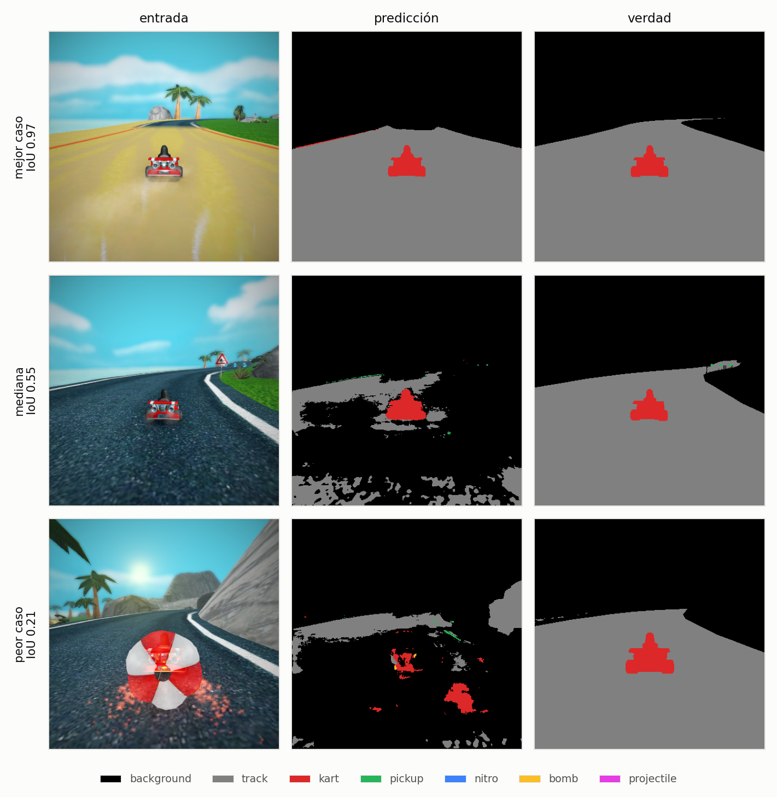
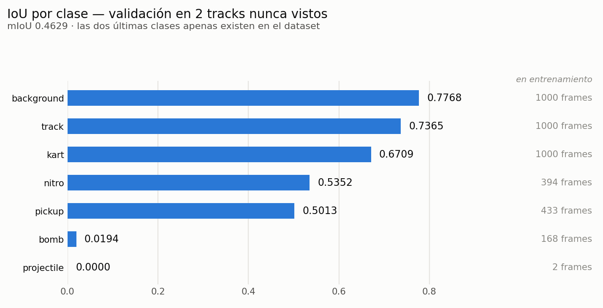
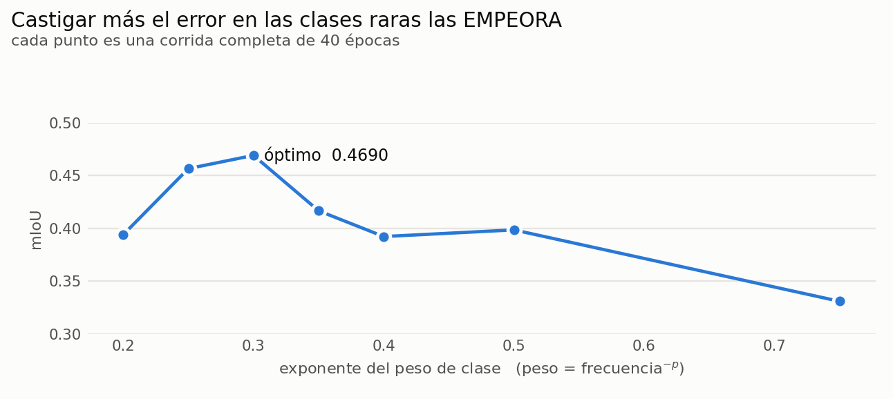

# Segmentación semántica de SuperTuxKart

U-Net entrenada desde cero en PyTorch que clasifica **cada píxel** de un frame del
videojuego en una de 7 clases: fondo, pista, kart, cajas de objetos, nitro, bomba
y proyectil.

*Actividad en Clase #2 · Visión Artificial 202520 · Universidad San Francisco de Quito*

<picture>
  <source media="(prefers-color-scheme: dark)" srcset="docs/figuras/cualitativo-dark.png">
  
</picture>

Los tres cuantiles del conjunto de validación. Ninguno de estos dos circuitos se
usó para entrenar.

---

## Probarlo

### Sin instalar nada — Colab

[](https://colab.research.google.com/github/ferjozsot23/vision-supertuxkart/blob/main/demo.ipynb)

Abre el notebook, *Ejecutar todas*, y sube tus imágenes cuando lo pida. Descarga
el código y el modelo por su cuenta, funciona en cualquier resolución y devuelve
las máscaras en un zip.

### En local — tres comandos

```bash
pip install -r requirements.txt
python predict.py ejemplos/                    # las imágenes de ejemplo del repo
python predict.py mis_imagenes/ --out salida/ --masks
```

Cada imagen produce un panel `original | segmentación | superposición`. Con
`--masks` guarda además la máscara cruda de 1 canal con valores 0–6.

```
$ python predict.py ejemplos/
modelo cargado en cpu
volcano_01.png       -> volcano_01_seg.png    back 45.5% trac 53.0% kart 1.5%
lighthouse_01.png    -> lighthouse_01_seg.png back 68.3% trac 30.7% kart 1.0%
```

Si falta `model.th`, `predict.py` lo descarga solo (o dice exactamente de dónde
bajarlo). Las imágenes de `ejemplos/` son de circuitos que el modelo nunca vio.

### Desde tu propio código

```python
from models import load_model

model = load_model('model.th')      # sin argumentos
pred  = model(x).argmax(1)          # x: (B,3,H,W) en [0,1]  ->  (B,H,W)
```

Tres cosas que hacen que esto funcione en cualquier máquina:

- **La imagen entra cruda en `[0,1]`.** La normalización ImageNet vive dentro del
  `forward` como buffers del modelo, así que viaja con los pesos.
- **Cualquier resolución de entrada.** El `forward` rellena a múltiplo de 16 y
  recorta de vuelta. Verificado desde 96×128 hasta 1080×1920.
- **`load_model()` deduce la arquitectura de los propios pesos**, así que no puede
  fallar por un desajuste entre el `--base` con el que se entrenó y el que
  espera el constructor.

---

## Resultados

<picture>
  <source media="(prefers-color-scheme: dark)" srcset="docs/figuras/iou-dark.png">
  
</picture>

U-Net `base=64` · 31 M parámetros · 256×256 · `lr` 3e-4 · `CrossEntropyLoss` con
pesos de clase. Medido con una matriz de confusión acumulada sobre los 500 frames
de validación, nunca promediando IoU por lote.

**El split es por circuito, no por frame.** Los frames de un mismo circuito son
casi idénticos entre sí —el kart avanza unos centímetros por frame—, así que un
split aleatorio pondría frames prácticamente gemelos a ambos lados y daría un
mIoU alto y falso.

| | circuitos | frames |
|---|---|---|
| entrenamiento | `abyss`, `gran_paradiso_island`, `hacienda`, `olivermath` | 1000 |
| validación | `lighthouse`, `volcano_island` | 500 |

> **Cuánto vale un decimal aquí.** Al repetir una configuración idéntica dos
> veces obtuvimos 0.4690 y 0.4298: **±0.04 de varianza** por inicialización y
> orden de los lotes. Las diferencias menores que eso no son significativas.

---

## Qué movió la aguja

Se probaron 22 configuraciones. Estos son los efectos que superan el ruido:

| cambio | efecto |
|---|---|
| Resolución 128 → 256 | **+0.05** |
| Exponente del peso de clase 0.75 → 0.30 | **+0.10** |
| Más capacidad (`base` 32→64) **junto con** menos `lr` | **+0.03** |
| Resolución 256 → 384 | +0.002 por 2.5× de cómputo — no compensa |
| Recorte aleatorio (augmentation geométrica) | **empeora**, en las 3 configuraciones probadas |

### Bajar el peso de las clases raras es lo que las mejora

<picture>
  <source media="(prefers-color-scheme: dark)" srcset="docs/figuras/power-dark.png">
  
</picture>

Contraintuitivo, y el desglose de confusión explica por qué: con pesos altos,
`pickup` acertaba el **84.7%** de sus píxeles pero su IoU era **0.17**. Alta
cobertura con IoU bajo solo significa una cosa —el modelo la pintaba por todas
partes—, y los falsos positivos hunden el IoU aunque no toquen la cobertura.

### Capacidad y learning rate no se pueden probar por separado

`base=64` da **0.4220** con `lr=1e-3` y **0.4690** con `lr=3e-4`. Explorando un
eje cada vez, más capacidad habría parecido inútil. Solo apareció al barrer los
dos a la vez.

---

## Arquitectura

U-Net de 4 niveles con *skip connections*, escrita desde cero. Las skips son el
motivo de elegir U-Net sobre un FCN: recuperan el detalle fino que necesitan
objetos de veinte píxeles como el nitro.

```
enc1  64 ──────────────────────────────────┐ skip
  ↓ pool                                   │
enc2 128 ────────────────────────┐ skip    │
  ↓ pool                         │         │
enc3 256 ─────────────┐ skip     │         │
  ↓ pool              │          │         │
enc4 512 ──┐ skip     │          │         │
  ↓ pool   │          │          │         │
bottleneck 1024       │          │         │
  ↑ upconv │          │          │         │
dec4  512 ─┘          │          │         │
  ↑ upconv            │          │         │
dec3  256 ────────────┘          │         │
  ↑ upconv                       │         │
dec2  128 ───────────────────────┘         │
  ↑ upconv                                 │
dec1   64 ─────────────────────────────────┘
  ↓
conv 1×1  →  7 logits por píxel
```

Sin softmax al final: `CrossEntropyLoss` espera logits crudos.

---

## Limitaciones

**`projectile` aparece en 2 frames de los 1500** del dataset, y **`bomb` en 168**.
Su IoU de 0.00 y 0.02 es falta de datos, no del modelo: ninguna de las 22
configuraciones los movió. El desglose de confusión muestra que los píxeles de
`bomb` acaban en `background` (53.8%) y en `kart` (22.9%) — como las bombas van
pegadas a los karts, se absorben dentro del kart.

**El error dominante es `track` → `background`**, un 17.4% de 16.9 M píxeles. Al
mirar las predicciones se ve por qué: el modelo reconoce la carretera por brillo
y textura, y los circuitos de validación tienen superficies (asfalto oscuro
moteado, barro naranja nocturno) que no se parecen a ninguna de las cuatro de
entrenamiento. Es una brecha de **generalización**, no de ajuste.

La vía más prometedora para cerrarla sería un encoder preentrenado en ImageNet
manteniendo el decoder, que aportaría filtros de bajo nivel robustos al cambio de
dominio. Quedó fuera de este trabajo.

---

## Reproducir

```bash
python train.py --data-root <ruta>/dense_data \
    --size 256 256 --base 64 --lr 3e-4 --weight-power 0.25 --epochs 40

# barrido de hiperparámetros, repartible entre varias GPUs
python experimentos/sweep.py --data-root <ruta>/dense_data \
    --bases 32 64 --lrs 1e-3 3e-4
```

El dataset se organiza por circuito; el target sale de `combined/`, que ya
resuelve la precedencia de solapamientos (un kart sobre la pista, un proyectil
sobre el kart). `combined_visual/` **no** se usa: sus valores son 0, 32, 64… y
romperían `CrossEntropyLoss`. La máscara se lee sin conversión de color y se
redimensiona con **NEAREST** — interpolarla inventaría clases inexistentes en los
bordes entre objetos.

```
.
├── models.py            U-Net, save_model / load_model
├── utils.py             Dataset, augmentation, ConfusionMatrix, pesos de clase
├── train.py             loop de entrenamiento, validación por época, --resume
├── eval.py              panel comparativo contra la máscara real
├── predict.py           punto de entrada: segmenta una imagen o una carpeta
├── class_weights.json   conteo de píxeles por clase del conjunto de entrenamiento
├── demo.ipynb           notebook de Colab
├── requirements.txt
│
├── ejemplos/            4 imágenes para probar sin descargar el dataset
│
├── experimentos/
│   ├── sweep.py             barrido de hiperparámetros, repartible entre GPUs
│   ├── comparar.py          compara corridas de runs.csv
│   ├── consolidar.py        une los resultados de las particiones paralelas
│   ├── evaluar_modelos.py   vuelve a medir un .th sobre validación
│   └── resultados/          runs.csv y las tablas del barrido
│
├── servidor/            orquestación del entrenamiento en el DGX
│   ├── lanzar.sh            (local) sube el código y lanza
│   ├── entrenar.sh          (remoto) una corrida
│   ├── entrenar_paralelo.sh (remoto) reparte el barrido entre varias GPUs
│   ├── estado.sh            (local) progreso
│   ├── recoger.sh           (local) descarga modelos, métricas y logs
│   └── diagnostico.sh       (local) inspecciona el entorno del servidor
│
└── docs/
    ├── figuras/         las gráficas de este README, en claro y oscuro
    └── generar_figuras.py
```

**Los cuatro entregables del enunciado —`train`, `eval`, `utils` y el modelo—
están en la raíz a propósito**, junto a `models.py`. Así `from models import
load_model` funciona sin instalar el proyecto ni tocar `PYTHONPATH`, que es lo
que hace la celda de Colab y lo que hará cualquiera que copie el `.th` a otra
carpeta. Todo lo demás es andamiaje y vive en su subcarpeta.

Entrenado en un DGX H200 (torch 2.13, CUDA); el `.th` verificado en macOS con
torch 2.11 sobre CPU. Solo depende de `torch`, `numpy` y `Pillow`.
